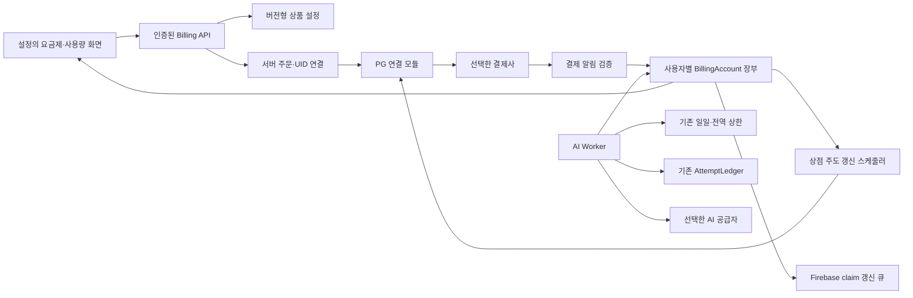

# 유료화 공통 기반 설계 초안

2026-10-08 · Codex 작성 · Claude 검토 2회 합의(`HANDOFF-185`) · 구현 없음.
사용자 방향: 가격·결제사 등 구체적인 선택 전에 공통 구조를 설계한다.
2026-10-08 추가: [서비스 준비 설계](SERVICE-READINESS-DESIGN.md)의 계정·보안·운영·UI 확장은
`HANDOFF-186`에서 Claude 검토(결함 0)를 받았다. 출시는 P1 초대 유료 베타 → P2 공개 판매 두 단계다(통합 레일 R9 세부).
[시장조사](LAUNCH-DECISIONS.md)의 추천 가격은 확정값으로 사용하지 않는다.
이 문서는 [기존 결제 경계](BILLING-ARCHITECTURE.md)를 구체화하며 실행 상태는
[통합 레일](DEV-TOKEN-ROADMAP.md)에만 기록한다.

## 1. 목표와 현재 연결점

상품 설정 → 결제 확인 → 구독 권한 → AI 사용량 → 화면 표시를 하나의 흐름으로 만든다.
가격·한도 숫자와 PG별 통신은 교체할 수 있게 두고, 권한의 주인과 중복 처리 기준은 먼저 고정한다.
첫 설계 범위는 단일 사용자와 AI 사용량으로 제안한다. 판매 범위 확정은 후속 사용자 결정이다.
팀 좌석·저장량 과금은 별도 서버 집계가 필요하다.

| 현재 코드 | 설계에서 연결할 자리 |
| --- | --- |
| `worker/index.js:dailyLimit()` | 검증된 `pedagogy_plan`을 읽는 기존 일일 안전 상한. 기간별 상품 한도는 새 서버 장부에서 판정 |
| `DailyQuota`·전역 일일 quota | 사용자·서비스 비용 방어를 유지. 구독 기간별 사용량과 별도 기록 |
| `AttemptLedger` | B5의 중복 공급자 호출 방지. 결제 이벤트나 구독 상태를 넣지 않음 |
| `updatePlanBadge()` | 화면의 요금제 표시. 최신 서버 권한·사용량 조회 화면으로 확장 |
| B6/B7 staging·outbox | 이미 처리한 응답의 복구. 복구/채택 자체로 추가 AI 사용량을 차감하지 않음 |
| `service-config.js` | 공개 API 주소·출시 여부만 둠. 권한·PG 비밀·확정 요금의 서버 원장은 두지 않음 |

## 2. 전체 구조

추천 저장 방식은 **사용자별 `BillingAccount` Durable Object**다. 구독 권한과 기간별
사용량을 같은 객체의 영속 트랜잭션에서 확인·변경한다. 서버 내부 호출만 허용하고
사용자가 owner·기간·한도를 조립해 객체를 선택할 수 없게 한다.
주문/PG 고객 ID를 UID에 연결하는 서버 전용 색인은 별도로 둔다. Firebase Admin
claim 갱신은 권한 있는 서버 모듈로 격리한다. PG 선택 후 해당 SDK·비밀 관리와 맞는
실행 환경을 확정하며, 이 초안으로 신규 바인딩·서버를 배포하지 않는다.

## 3. 먼저 고정할 데이터 계약

| 레코드 | 필드와 책임 |
| --- | --- |
| `PlanVersion` | 안정적인 plan ID·버전, 판매 상태 `draft/active/retired`, 가격/통화/결제 주기, 기능별 사용량 정책 ID. draft의 미정 값은 `null`; active 검증에서는 필수값 누락을 거절 |
| `PolicyVersion` | 사용량 단위·기간 생성 규칙·갱신/해지/유예·환불 규칙의 버전. 의미가 달라진 정책을 같은 버전으로 덮어쓰지 않음 |
| `Order` | 서버 생성 ID, 인증 UID, plan/policy 버전, 가격·통화 스냅샷, PG ID, 상태. 브라우저의 가격·UID를 과금 기준으로 사용하지 않음 |
| `PaymentEvent` | provider/event ID, 본문 해시, 주문/결제 ID, 검증 근거, 수신·처리 상태, 처리 결과 revision. 원문 카드/개인정보 payload는 기본 보존하지 않음 |
| `Subscription` | 서버 결제 계정·구독 ID, UID 연결, plan/policy 버전, 갱신 주체 `merchant/provider`, 선택적 PG 구독 ID, 빌링키 참조, 현재 상태·유효 기간, 다음 청구 시각, 갱신 세대·예약 변경, 마지막 확인 근거 |
| `BillingCycle` | 서버 구독 ID·청구 기간으로 유일한 cycle ID, 고정 주문/금액/상품 버전, 청구 시도·PG 결과·다음 확인 시각. 사용량 지급 기간과 별개이며 동일 청구 기간의 성공은 한 번만 반영 |
| `ConsentRecord` | 변경 ID, 인증 owner, 변경 전후 금액·결제방법·적용 시각, 고지 내용 버전, 별도 동의/철회 시각과 유효 범위. 최초 가입 동의를 변경 동의로 대체하지 않음 |
| `Entitlement` | 권한 revision, 유효 기간, 허용 기능, 적용 plan/policy 버전. 구독 상태에서 서버가 계산하며 브라우저가 쓰지 않음 |
| `UsagePeriod` | 서버 생성 period ID, `[start,end)` UTC 시각, 기능별 할당/예약/사용량. owner·정책으로 정한 기간이며 매 요청마다 새로 만들지 않음 |
| `UsageOperation` | 서버 사용량 작업 ID, attempt 연결, period ID, 권한 revision, 예약/확정/해제·외부 호출 시작 여부. 재전송에도 같은 작업은 한 번만 처리 |
| `ClaimOutbox` | entitlement revision별 Firebase 반영 대기·성공/실패. 권한 장부 변경과 함께 기록하여 claim 쓰기 실패를 재처리 |

**사용량 기간과 결제 주기는 별개**다. 연간 결제로 월마다 사용량을 지급할 수도 있으므로
월말·결제일 기준 같은 최종 규칙은 `PolicyVersion`으로 정한다. 미정일 때 fixture에서는
명시적인 start/end로 검증한다. 클라이언트가 시계·period ID를 바꿔 한도를 초기화하지 못한다.
같은 기간의 플랜 변경도 사용량을 0으로 만들지 않는다. 추가 지급/차감 정책은 확정 뒤 적용한다.

AI 일괄 추출은 `intake.page` 단위로 계측한다. 이 계측 단위와 실제 상품 차감량은 구별한다.
기존 사진 추출과 AI 문서 생성도 각각 정책에
명시적으로 연결한다. 문서 생성 요청을 임의로 '한 쪽'으로 환산하거나 사용량 검사에서
제외하지 않는다. 과금 대상 task에 적용 정책이 없으면 출시 설정 검증이 실패해야 한다.

## 4. 결제 확인과 구독 상태

1. 로그인·App Check를 검증하고, 서버 상품 설정으로 주문을 만든다. 가격/통화/상품 버전을 고정한다.
2. PG별 모듈이 결제창/정기결제 요청을 연결한다. 브라우저·공개 설정은 카드번호·빌링키·결제 비밀을 보관하지 않는다.
3. webhook은 선택한 PG의 공식 검증 방식으로 확인한다. 서명 또는 서버 조회를 통해
   결제 사실·금액·통화·주문 연결을 확인하며, PG마다 서명 헤더가 있다고 가정하지 않는다.
4. 검증된 이벤트를 영속 inbox에 기록한 뒤 수신 성공을 응답한다. 이후 실패는 서버 처리 큐에 남긴다.
5. 사용자 장부에서 이벤트 처리와 entitlement revision 변경, claim 반영 대기를 함께 기록한다.
6. 화면은 서버 조회에서 권한을 확인한다. 결제 완료 URL은 '확인 중' 진입 경로다.

동일 provider/event ID의 동일 본문은 기존 결과를 반환한다. 같은 ID에 다른 본문이면
변경하지 않고 검토 대상으로 남긴다. **수신 순서·event 시각만으로 최신 상태를 판단하지 않는다.**
역순/충돌 이벤트는 PG의 현재 결제 조회와 대조한다. PG가 구독을 관리할 때만 구독 조회도 사용한다.
상점이 관리하는 구독 상태는 우리 장부에서 확인한다. 조회를 기다리는 사이 장부가
변경되면 revision을 재검사하고 다시 조회한다. 같은 결제의 환불/차지백 확정 뒤 늦은
성공 알림이 그 결제를 되살릴 수 없도록 결제 ID별 종결 상태도 보존한다.
다음 정상 결제와 옛 결제의 재전송은 구분한다.

| 관측 상태 | 공통 엔진의 처리 | 나중에 정할 값 |
| --- | --- | --- |
| 확인 중 | 새 유료 권한을 부여하지 않고 현재 확정 권한만 사용 | 조회 재시도 간격·지원 안내 |
| 유료 전환·가격 인상 동의 대기 | 적용 대상 변경의 별도 동의를 확인하기 전 전환·증액 청구 차단 | 전환일·고지 화면·동의 후 적용 정책 |
| 유효한 결제·구독 | 서버 확인 기간과 상품 정책으로 권한 생성 | 가격·지급량·기간 규칙 |
| 다음 갱신 해지 예약 | 예약을 기록하고 정책이 정한 종료 시각에 전환 | 즉시/기간말 해지 지원 범위 |
| 결제 실패 | 실패와 기존 유효 기간을 기록 | 재시도·유예 여부/길이 |
| 환불·차지백 | 결제 ID 종결을 기록하고 확정 정책으로 권한 재계산 | 전액/부분 환불의 기간·지급량 처리 |
| 기간 종료 | 서버 시각으로 유효 권한 만료 | 무료 전환 범위 |
| 계정 삭제 중/완료 | 새 주문·사용량 승인·늦은 권한 부여를 차단 | 결제 기록의 합법적 보존 범위 |

구독 만료로 사용자 원문/문제집을 자동 삭제하는 정책은 넣지 않는다. 기존 보존·export
계약을 유지하고 유료 AI 기능의 권한을 별도로 판정한다.

### 4-1. 갱신 주체를 두 방식으로 지원

**상점 주도 갱신**은 공통 엔진의 기본 지원 범위다. 토스페이먼츠는 빌링키를 발급하고
상점이 주기마다 승인 API를 호출하는 방식이다. 구독 주기/취소는 상점에서 관리하므로
PG 구독 객체나 '구독 해지 확인'을 필수 인터페이스로 요구하지 않는다.
[토스페이먼츠 공식 안내](https://docs.tosspayments.com/guides/billing/overview).

- `BillingAccount`의 영속 다음 청구 시각을 DO alarm 또는 Cron 작업자가 확인한다.
  중복 실행은 같은 `BillingCycle`에 합류한다. 알람은 메모리 타이머로 대체하지 않는다.
- 청구 전 장부 트랜잭션에서 활성 상태·갱신 세대·동의·금액·기간을 다시 확인하고 실행권을 얻는다.
  구독 ID와 청구 기간으로 결정되는 주문 ID를 사용한다. 네트워크 재전송은 같은 주문/멱등 키를
  쓰고, 실제 PG의 중복 방지 보장과 보존 기간은 어댑터 검사로 확인한다.
- PG 통신은 장부 트랜잭션 밖에서 수행한다. 실행 시작 기록 뒤 응답 유실/중단은 결과 불명으로
  보존하고 기존 주문을 조회한다. 새 주문으로 자동 재청구하지 않는다. 명확한 실패가 확인되고
  정책이 허용한 재시도만 같은 cycle 아래 별도 시도로 기록한다. 재시도 횟수·간격·유예는 정책값이다.
- 실행 시작 승인과 해지/동의 철회는 같은 장부에서 직렬화한다. 해지/철회가 먼저 확정되면
  시작을 거절한다. 시작 승인이 먼저 확정된 작업은 아직 PG 결과가 없을 수 있으므로
  진행 중으로 추적하고 취소/환불로 처리한다. 해지/철회가 이미 승인된 청구까지 즉시 취소한다고 약속하지 않는다.
- 빌링키는 서버 전용 암호화 저장소에 두고 장부는 참조만 가진다. 서버 밖·로그로 반환하지 않는다.
  구독 해지/계정 삭제 시 갱신 세대를 올리고 스케줄을 중지한 뒤, 해당 키의 다른 활성 연결이
  없는지 확인해 PG 키 삭제와 서버 보관본 파기를 재처리한다.
- 상점 해지는 우리 장부의 갱신 중지 확정이다. 키 폐기 대기와 이미 시작된 청구의 결과 불명은
  별도 상태로 표시한다. 해지 성공이 진행 중 결제의 취소/환불까지 끝났다는 뜻은 아니다.

**PG 주도 갱신**은 어댑터의 다른 방식이다. PG 구독 ID·상태 조회·갱신 중지 확인을 연결하되
권한 부여는 검증된 결제와 우리 정책으로 계산한다. 동의 대기·해지·삭제는 원격 갱신 중지도
확인해야 하며, 상점 스케줄러와 PG 갱신을 동시에 켜지 않는다.

### 4-2. 유료 전환·증액 동의

정기결제 증액과 무료→유료 정기결제 전환은 별도 동의 경로를 둔다.
법 제13조⑥과 시행령 제20조의2의 확인 기준은 **적용 전 30일 내 동의·고지**다.
이를 '최소 30일 전에 동의'로 구현하지 않는다. 법무 검토로 적용 대상·기간 계산과 고지 내용을
확정한 뒤 활성화한다. [현행 법률](https://www.law.go.kr/LSW/lsInfoP.do?ancNo=21312&ancYd=20260120&efYd=20260721&lsiSeq=282793),
[시행령 제·개정문](https://law.go.kr/LSW/lsRvsDocListP.do?chrClsCd=010202&lsId=009338&lsRvsGubun=all).

새 `PlanVersion` 등록만으로 기존 구독의 금액을 덮어쓰지 않는다. 기존 구독에는 예약 변경과
해당 변경에 대한 `ConsentRecord`를 연결하고, 변경된 금액/일시의 동의를 서버에서 확인한다.
청구 직전 만료·철회·금액/적용일 변경을 재검사한다. 동의가 없거나 유효하지 않으면
유료 전환·증액 청구를 실행하지 않는다. 전환 취소/종료/기존 가격 유지 등 후속 처리는
확정 정책으로 정하되 미정 상태에서는 변경 청구를 차단한다.
PG 주도 방식도 동의 전에 원격 자동 증액/전환을 예약하지 않도록 어댑터에서 강제한다.
동의·철회 API와 화면은 별도 경로이며 최초 가입 약관 체크나 PG 빌링키 발급 성공으로 대신하지 않는다.

## 5. AI 사용량과 권한의 판정 지점

Firebase custom claim은 토큰 재발급 때 갱신되므로 환불 직후에도 오래된 plan을 가진
토큰이 남을 수 있다. 유료화 공통 기반 활성화 후 **무료 사용자를 포함한 모든 계측 대상 AI 호출**은
**사용자 장부의 현재 entitlement·기간별 사용량**으로
최종 판정한다. claim은 기존 호환·화면 표시용 projection이며 다른 claim 필드를 보존한다.
장부가 불명/조회 실패이면 더 넓은 일일 기본값으로 우회하지 않고 요청을 보류한다.
무료 정책도 `PolicyVersion`에 단위·지급량·기간 기준(가입일/달력 월 등)을 명시한다.
무료 월 30쪽은 시장조사 추천이며 확정값이 아니다. 설정된 기간 한도와 기존 일일 안전 상한을
모두 적용하여, 무료 사용자가 일일 상한만으로 기간 한도를 우회하지 못하게 한다.
무료→유료 또는 유료→무료 전환 시 사용량의 이월/지급 규칙도 서버 정책으로 정하며 미정이면
임의로 초기화하지 않는다. 기존 서비스에서 공통 기반으로 전환할 때는 모든 계측 task의
기간 정책·권한·장부가 준비된 뒤 활성화하며 일부 task의 일일 상한 우회 경로를 남기지 않는다.

요청 흐름은 기존 인증·입력 검증·intake 차단 뒤, AttemptLedger 확인 → 기간별 예약 →
기존 사용자/전역 일일 예약 → 기간별/일일 사용 확정 → 외부 AI 호출 순서로 통합한다.
기간별 예약과 사용 확정 각각에서 owner·현재 권한 revision·기간 경계를 재확인한다.
환불이 확정 전에 반영되면 호출을 막는다. **사용 확정이 먼저 끝난 이미 승인된 요청은
처리를 마칠 수 있으며**, 이후 요청은 새 권한으로 판단한다.

여러 DO의 변경은 한 트랜잭션이 아니다. 조정 기록으로 각 예약/확정 영수증과 외부 호출
시작 여부를 남긴다. 확정 일부 실패 때 공급자를 부르지 않고, 서버가 외부 호출 미시작을
확인한 작업에만 기간별 고객 사용량을 보상한다. 보상도 같은 operation ID로 한 번만 한다.
기존 일일/전역 비용 상한의 보수적 집계와 고객의 기간별 사용량은 화면에서도 구별한다.
프로세스가 외부 호출 시작 여부를 확정할 수 없으면 자동 사용량 반환·자동 재호출하지 않는다.
이 장애 경계는 실제 Worker 연결 묶음에서 별도로 검증해야 한다.

이번 초안은 기존 사용자 `DailyQuota`를 별도 DO로 유지한다. `BillingAccount` 안에 합치는
최적화는 후속으로 평가한다. 현재 일자별 키·48시간 alarm 파기·purge 계약을 장기 결제 장부로
옮기는 변경은 별도 검증이 필요하다. 먼저 부분 확정/보상 경계를 검증하고, 합칠 경우에도
일일 카운터만 파기하며 결제/기간별 장부까지 `deleteAll()`하지 않도록 설계해야 한다.

공급자 호출을 시작한 뒤 오류·유실은 기존 비용 상한 계약을 따른다. 명시 재시도는 새 시도로
계산하고, B5 성공 잠금/B7 응답 복구/이미 생성된 문항 재배열은 새 호출로 계산하지 않는다.
새 job ID·계정 삭제·플랜 변경으로 사용량을 초기화하는 경로를 허용하지 않는다.
AI 공급자 선택은 서버 설정으로 연결하고 R2의 자동 라우팅/자동 재시도 금지를 유지한다.

## 6. API와 화면 계약

| 인터페이스(제안) | 책임 |
| --- | --- |
| `GET /billing/catalog` | 판매 가능한 확정 상품 표시. 가격 미정 상품은 결제 가능한 목록에서 제외 |
| `GET /billing/me` | 인증 owner의 현재 구독·권한·기간별 사용량·처리 중 상태. 다른 owner를 query로 선택하지 않음 |
| `POST /billing/orders` | 상품 버전으로 주문 생성. 재전송 키는 UID와 함께 서버에서 묶음 |
| `POST /billing/subscription/cancel` | 본인 확인 후 상점 주도는 장부의 갱신 중지 확정, PG 주도는 원격 중지 확인. 빌링키 폐기/진행 중 청구 상태는 별도 반환 |
| `POST /billing/changes/{id}/consent` | 서버 고지 내용·금액·적용일에 대한 본인의 별도 동의 기록. 브라우저가 변경 내용을 재정의하지 않음 |
| `POST /billing/changes/{id}/withdraw` | 별도 동의 철회·변경 취소 기록. 청구 작업이 재확인할 revision 갱신 |
| `POST /billing/refund-requests` | 환불 요청 접수. 금액/승인을 클라이언트가 결정하지 않음 |
| `POST /billing/webhooks/{provider}` | PG 검증 → 영속 inbox. 사용자 API와 별도 인증 경계 |
| 내부 `reserve/consume/release/reconcile` | AI Worker·서버 처리자 전용. 브라우저 쓰기 API로 노출하지 않음 |

설정에 '요금제·사용량'을 둔다. 현재 권한·사용한 양/총량·기간 종료·갱신/해지 예약과
확인 중/지원 필요 상태를 보여 준다. 여러 탭의 오래된 숫자로 호출 가능을 약속하지 않는다.
마지막 확인본을 표시하는 경우 조회 시각과 미확정 상태를 함께 표시한다.
결제·환불 상태와 앱의 기기 저장/클라우드 ACK 상태를 섞지 않는다.
첫 구현은 모의 상품·모의 결제 상태를 사용하는 검증 경로이며 실제 판매 UI 공개는 후속이다.

## 7. 삭제·개인정보·운영

계정 삭제는 서버 fence·갱신 중지 뒤 PG/빌링키 정리와 개인자료 파기를 각각 재개 가능한
작업으로 기록한다. PG 장애가 개인자료 삭제를 무기한 막지 않도록 분리한다. 현재 기기
원문·staging/outbox·B5 파기 확인 후 Auth 삭제하는 U0 순서는 유지한다. 브라우저 종료로
기기 확인이 없으면 해당 단계는 미완료이며 다음 실행에서 이어간다. 상세 경계는 서비스 설계 §3·§8을 따른다.
PG 통신 실패나 결과 불명이면 완료로 표시하지 않는다. 옛 webhook이 도착해도
닫힌 UID 연결을 새 계정에 자동 이관하거나 entitlement를 다시 만들지 않는다.
상점 주도 갱신은 fence와 함께 스케줄을 중지하고 빌링키 폐기 작업을 남긴다.
PG 주도 갱신은 원격 구독 중지를 확인한다. 삭제와 겹친 이미 시작된 청구는 기존 주문으로
결과를 확인하고 필요한 취소/환불을 처리한다. 결과 불명 상태를 새 청구로 해소하지 않는다.

결제 증빙·감사 기록의 보존 기간은 AI 원장의 7일 또는 DailyQuota의 48시간을 복사하지 않는다.
계정 삭제 뒤 남길 최소 결제 기록·삭제 차단 기록은 실제 법무/계약 결정으로 정한다.
대시보드/로그에는 원문·AI 응답·카드 정보·토큰·비밀을 넣지 않는다.
재처리 대상 수·갱신 지연/결과 불명·빌링키 폐기 대기·동의 미확인·claim 반영 지연·quota 보상 실패·PG 상태 불일치를 운영 지표로 둔다.

## 8. 구현 묶음과 결정 시점

| 묶음 | 만들 것과 완료 기준 | 결정이 필요한 시점 |
| --- | --- | --- |
| F0 · 기반 합의·확장 검토 완료 | 데이터/권한/실패 경계의 기존 185 합의 유지. 서비스 준비 확장은 186 검토 결함 0 | 실제 가격·PG 미정 가능 |
| F1 · 공통 엔진 fixture | 상품/정책 설정 검증, 주문 스냅샷, 상점/PG 주도 갱신·동의 상태 전이, 중복/역순 이벤트 처리, 가짜 PG·시계·영속 저장 인터페이스. 실제 상태 머신을 Node에서 실행 | 설계 합의 후 가능. 수치는 테스트 전용 |
| F2 · 영속 장부·사용량 fixture | 사용자별 장부·무료/유료 기간별 원자 예약/확정·실패 보상 기록·청구 스케줄/결과 불명 재처리·삭제 fence. 실제 영속 어댑터는 격리 환경에서 검증 | 서버 저장 방식·계정 삭제 경계 설계 검토 |
| F3a · 서버 연결 | 기존 quota·AttemptLedger·B7·계정 상태·삭제/동의 API, 직접 Firebase 쓰기 경계. AI/PG stub | R5·F2·한도 단위. Rules 변경은 별도 PR/전환 검증 |
| F3b · 고객 화면 | 서비스 설계 §6의 요금/결제/카드/내역/해지/환불/데이터/지원 상태 | F3a 검토·merge 뒤 별도 PR |
| F3c · 운영/지원 | 서비스 설계 §7의 보호된 명령·역할/감사·알림·재처리 | F3b 검토·merge 뒤 별도 PR, 실발송 없음 |
| F4 · 선택한 PG 연결 | 공식 검증·결제 조회·정기결제/해지·claim 갱신·재처리·운영 관리. PG sandbox 종단검사 | PG 선택·테스트 자격 증명·정책 결정 필요 |
| F5 · 상품 확정·활성화 준비 | 가격/기간/환불·약관·운영 증거와 ReleaseManifest 검증 | D7~D13·L1~L4·C3·R7·R8 기본/결제 확장 뒤 준비, R10 판정/사용자 승인 후 활성화 |

F1/F2까지는 운영 endpoint에 붙이지 않는 별도 모듈로 검토할 수 있다. 각 묶음의 선행·담당은
[통합 레일 'R9 세부'](DEV-TOKEN-ROADMAP.md#r9-세부--유료화-갈래-fl-2026-10-08)가 정한다.
F1/F2의 영속 작업·환불/삭제·claim/알림·장부 복구와 F4 수용 범위는 서비스 설계 §2~§9를 함께 적용한다.
다만 **이번 사용자 요청은 F0 설계까지**다. 단계별 구현 요청·비구현자 검토를 거치며
사전 설계로 R5·R9 전체나 상용 출시 게이트를 완료 처리하지 않는다.

## 9. 반드시 빨간불을 확인할 수용 검사

| 사례 | 확인할 결과 |
| --- | --- |
| 가격·owner·기간 위조 | 서버 주문/인증 owner 기준, 잘못된 값 거절 |
| 완료 redirect만 도착 | 유료 권한 부여 없음 |
| 중복 알림·중복 주문/환불 요청 | 동일 결과 ID·권한 변경·보상은 각 1회 |
| 상점 갱신 작업 중복·청구 응답 유실 | 같은 cycle/주문에 합류, 결과 불명은 조회하며 신규 주문으로 자동 재청구 없음 |
| 해지/삭제와 갱신 경합·빌링키 폐기 실패 | 세대 변경 후 새 청구 차단, 이미 시작된 청구/키 폐기를 추적하고 완료를 과장하지 않음 |
| PG 주도 갱신·동의 대기 | 상점 스케줄과 중복 실행 없음, 확인되지 않은 전환/증액을 원격 예약하지 않음 |
| 동의 누락·철회·기간 밖 동의·금액/적용일 변경 | 최초 가입 동의로 대체하지 않음, 전환/증액 청구 차단 |
| 환불 뒤 옛 성공 알림·역순 갱신 | 옛 결제 부활 없음, 신규 정상 결제와 구별 |
| 영속 기록 뒤 프로세스 중단 | 재처리로 한 번만 반영, 메모리 장부로 대체하지 않음 |
| 권한 기록 성공·Firebase claim 실패 | 서버 권한 유지, 반영 큐 재처리, 다른 claim 보존 |
| 오래된 유료 토큰·환불/기간 종료 | 장부의 현재 권한으로 다음 사용 확정 거절 |
| 마지막 1쪽의 동시 요청 | 한 요청만 확정; 새 job/플랜 전환으로 초기화 없음 |
| 무료 기간 한도·무료/유료 전환 | 무료도 기간별 장부 검사, 일일 상한·새 job으로 기간 한도 우회 없음 |
| 월말·윤년·연간 상품·기간 경계 | 결제 주기와 사용 기간 구별, 서버 start/end로 판정 |
| quota 확정 일부 실패/보상 재전송 | AI 호출 없음, 확정 미시작 증거에 따른 고객 사용량 보상 1회 |
| 공급자 오류·응답 유실·B7 복구 | 기존 시도 계약 유지, 복구에서 추가 차감 없음 |
| A→B 계정 전환·삭제 중 늦은 알림 | 다른 owner 비노출, 삭제 fence 뒤 재부여 없음 |

각 구현 검사는 기준 커밋 또는 의도적 경계 제거로 실패를 확인한 뒤 CI에 연결한다.
실제 PG·클라우드 자격 증명·유료 AI를 사용한 검증은 별도 증거로 남긴다.

## 참고한 공식 문서

- [Firebase custom claims](https://firebase.google.com/docs/auth/admin/custom-claims): 권한 있는 서버가 설정하며 새 ID 토큰 발급/갱신에 반영.
- [Stripe webhook 안내](https://docs.stripe.com/webhooks): 중복·역순 이벤트 사례와 영속 재처리 설계 참고. Stripe를 PG로 선택했다는 뜻은 아님.
- [Cloudflare DO 메모리 상태](https://developers.cloudflare.com/durable-objects/reference/in-memory-state/): 인스턴스 메모리의 수명과 영속 저장 구별.
