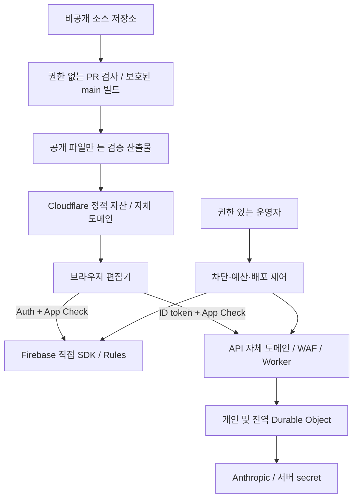

# 상용 출시 보안·소스 보호 아키텍처

결정일: 2026-09-11. 기준 코드: `90536cb`와 이번 작업의 로컬 diff.
**설계는 확정했지만 상용 출시 승인은 아니다.** App Check 코드와 공개 빌드의 외부 스크립트 분리까지 구현했다. 운영 배포·저장소 비공개
전환·콘솔 enforcement는 실행하거나 확인하지 않았다. 남은 증적은
[운영 체크리스트](SECURITY-OPERATIONS-CHECKLIST.md)에 기록한다.

## 1. 최종 결정과 우선순위

| 순서 | 결정 | 현재 코드와의 차이 / 완료 조건 |
| --- | --- | --- |
| P0 · 1단계 | 공개 산출물 허용 목록, 이벤트 속성 CSP, CI 최소 권한 | 이번 구현. 허용된 입력 17개와 추출 스크립트 5개로 공개 파일 22개를 생성하고 고장 주입 검사. 실제 호스팅은 미전환 |
| P0 · 출시 전 | private source → 검증된 public build → 상용 호스트 | 원본·이력·리뷰·Worker를 비공개 저장소에서 관리. GitHub Pages에서 상용 서비스 이전 |
| P0 · 출시 전 | Firebase와 Worker에 각각 App Check 강제 | 클라이언트 전송·Worker 검증 코드는 완료. site key·staging 양성/음성·운영 enforce는 미완료 |
| P0 · 출시 전 | 전역 AI 횟수 상한 + 운영 중단 + 공급자별 비용 통제 | 개인/전역 DO와 kill switch는 있음. 금액 상한·Firebase 총량·운영 반영은 별도 |
| P0 · 출시 전 | GitHub ruleset·비밀 보호·배포 권한 분리 | SHA 고정·CODEOWNERS·Dependabot 파일은 있음. 필수 리뷰·상태 검사·실제 활성화는 콘솔 증적 필요 |
| P1 · 공개 호스트 전환 때 | HTTP CSP, 페이지별 frame-ancestors, 외부 스크립트 분리 | 개발 원본은 inline script를 유지하고 공개 빌드는 외부 스크립트와 인라인 실행 차단 CSP를 사용한다. 현재 iframe 모의고사 구조를 보존해야 함 |
| P1 · 유료 저장량 약속 전 | 서버가 사전 승인하는 저장/업로드 원장 | 현재 Rules는 개별 문서/파일만 제한. 업로드 후 삭제는 엄격한 비용 상한이 아님 |
| P2 · 계약 요구에 따라 | DLP·CSPM·선별 서버 조판 | 이름 정규식 마스킹이나 난독화를 보안 보증으로 판매하지 않음 |

GitHub Pages의 공식 제한은 상용 SaaS를 위한 무료 호스팅 사용을 허용하지 않는다.
따라서 public build용 GitHub 저장소를 하나 더 만드는 것만으로 출시 호스팅 문제가 해결되지
않는다. **Cloudflare Workers Static Assets + 자체 도메인**을 목표 호스트로 선택한다.
요금제·도메인·실제 배포는 운영 확인 뒤 결정된 배치대로 진행한다.
[GitHub Pages 제한](https://docs.github.com/en/pages/getting-started-with-github-pages/github-pages-limits)

## 2. 신뢰 경계

도메인은 역할 표기다. 아직 실제 도메인을 만들지 않았다. 기존 Worker를 정적 자산 호스트와
분리해 quota binding·DO migration·기존 카운터를 보존한다. WAF는 자기 zone을 거친 요청만
보호한다. 브라우저의 Firebase 직접 호출은 Cloudflare WAF를 거치지 않는다.
Origin/CORS는 브라우저 정책이며 스크립트가 헤더를 위조하는 것을 막는 인증 수단이 아니다.

## 3. 원본 비공개와 공개 빌드

현재 제품은 루트 HTML 안에 CSS·전역 JS가 있고 `pedagogy-normalize.js`, `pedagogy-render.js`,
`pedagogy-print.js`, `mock-library-store.js`를 고전 스크립트로 로드한다. 모의고사는
`index.html`의 같은 출처 iframe이며 HWPX 엔진·템플릿도 브라우저에 전달된다.

**비공개 대상:** 전체 개발 이력, `worker/`, `reviews/`, `scripts/`, `tests/`, Rules,
운영 문서, Python 변환기·실험, 배포 자격 증명. `PUBLIC_FILES`에 있는 빈 HWPX 골격 두 개는
런타임 데이터 예외다. 파일 이름에 experiments가 있다고 디렉터리 전체를 허용하지 않는다.

**공개 대상:** 사용자가 실행할 HTML/CSS/JS, 공개 Firebase 설정·App Check site key,
배포 허가된 템플릿·라이선스 고지. Firebase API key를 감추는 것을 접근 통제로 삼지 않는다.

이번 `npm run build:public`은 `dist/public/`에 17개 허용 입력에서 22개 파일을 생성한다. 세 편집기의 인라인 스크립트 5개를 `assets/`로 추출하고 순서·바이트·전역 lexical scope를 보존한다. 입력의 중간
디렉터리까지 symlink를 거부하고 출력의 초과 파일/디렉터리, 소스맵 참조, 대표적인 비밀 패턴을
검사한다. `dist/public-manifest.json`의 파일별 SHA-256·바이트 수는 웹 루트 밖에 둔다.
`npm run check:public`은 산출물 허용 목록·금지 내용 검사다. manifest는 서명된 출처 증명이
아니며 이 검사는 완전한 secret scanner가 아니다. 실패한 빌드의 이전 산출물을 배포하지 않는다.

공개 빌드는 인라인 코드를 외부 파일로 분리하며 `script-src`의 unsafe-inline을 제거한다.
**주석 제거·압축·난독화·비공개 전환을 완료한 것은 아니다.** minify·해시 파일명·private sourcemap은 후속 선택사항이다. `file://`와 iframe·인쇄 훅 의존성 때문에
무조건 ESM/번들러로 바꾸지 않는다. 비밀은 애초에 브라우저 소스에 들어가면 안 된다.

운영은 보호된 private main의 동일 커밋을 빌드하고 검사한 **그 산출물**만 승격한다. 공개
저장소는 필수가 아니다. 공개 mirror가 필요할 때만 새 이력의 build-only 저장소를 만들고,
해당 저장소만 쓰는 GitHub App 권한으로 산출물을 보낸다. 원본 저장소 push/mirror, `.git`
복사, `dist` 전체 업로드, PR의 임의 artifact를 신뢰한 배포는 금지한다.

이미 공개된 이력·clone·fork·캐시는 회수할 수 없다. 비공개 전환은 이후 변경을 보호한다.
브라우저가 받은 코드는 압축해도 분석·복제할 수 있다. HWPX 조판까지 숨기는 것이 계약상
필수라면 유료 고급 조판만 인증된 서버로 옮기는 별도 제품 변경이 필요하다. 로컬 편집·기본
인쇄는 유지하며, 서버 이전에 비용·지연·교육자료 전송·보존 정책을 검증한다.

## 4. App Check와 Worker 검증 계약

`index.html`과 `document-editor.html`은 Enterprise provider를 초기화하고 AI 요청에
`X-Firebase-AppCheck`를 보낸다. site key는 아직 비어 있다. 빈 key 동안은 기존 호출을
유지하지만, 초기화된 뒤 토큰 획득 실패는 요청을 중단한다. `appCheckReady`는 초기화 여부이지
서버 enforcement 증거가 아니다.

클라이언트 공통 모듈은 Firebase 초기화 뒤 App Check를 초기화하고, AI 호출마다
`getToken(false)`의 토큰을 `X-Firebase-AppCheck` 헤더로 전달한다. 토큰을 URL·localStorage·
로그에 저장하지 않는다. 획득 실패는 설명 가능한 오류로 끝내고 빈 토큰 재시도로 우회하지 않는다.
Firestore/Storage SDK의 자동 전송과 자체 Worker로 보내는 헤더는 별도 경로다.
[웹 custom resource](https://firebase.google.com/docs/app-check/web/custom-resource)

Worker는 `worker/app-check.js` 독립 모듈로 다음 계약을 구현했다.

1. `/health`, OPTIONS는 사용자 정보 없이 허용. CORS 허용 헤더에 App Check를 추가한다.
2. 허용 경로·메서드·Origin 검사, kill switch와 헤더 크기 제한 후 ID token과 App Check를 검증한다.
3. App Check 전용 JWKS `https://firebaseappcheck.googleapis.com/v1/jwks`를 사용한다.
   Auth의 `securetoken@system.gserviceaccount.com` 키와 섞지 않는다. RS256 서명, `typ=JWT`,
   `iss=https://firebaseappcheck.googleapis.com/<project-number>`, audience의
   `projects/<project-number>`, 만료·발급 시각, 허용 app ID의 `sub`를 모두 검사한다.
   project ID 문자열과 project number를 혼동하지 않는다. 현재 공개 config의 number·app ID도
   운영 Console과 대조한 뒤 env에 고정한다.
4. 공개키 캐시는 응답 TTL과 6시간 이내로 제한하고 동시 갱신을 합친다. fetch timeout,
   unknown kid의 verifier별 60초 갱신 간격과 조회 실패의 5초 backoff, 캐시 만료+장애 시 fail-closed를 둔다. 임의 `jku`/`x5u`는 읽지 않는다.
5. 유효하지 않은 토큰은 401/403, 검증 인프라 장애는 503. 본문 읽기·quota·AI 이전에 끝내고
   ID token/App Check token/사용자 원문을 로그에 남기지 않는다.
6. `off → monitor → enforce` 전환은 서버 env만 제어한다. 알 수 없는 값은 enforce로 닫힌다.
   운영 출시는 enforce만 허용하며 `check:launch`가 off/monitor를 차단한다.
   monitor는 고정된 상태 코드 집계만 남긴다. 유효 토큰도 Auth·entitlement·quota를 면제하지 않는다.

이 계약은 Firebase의 [custom backend 검증](https://firebase.google.com/docs/app-check/custom-resource-backend)
절차에 기반한다. Workers에서 지원되는 고정 버전 JWT 라이브러리를 먼저 검토하고,
서명 fixture·변조·다른 프로젝트/app·만료·JWKS 교체/장애를 검증한다. 일반 JWT 검증은 토큰
재사용을 막지 않는다. 소비형 replay protection은 별도 Admin SDK 기능·권한·왕복 비용이
있으므로 필요 시 고위험 endpoint에 한정해 설계한다. App Check는 브라우저 진위의 절대 보증이 아니다.

Firebase는 metrics 관찰 후 Firestore·Storage 각각 enforcement를 켠다. Authentication은
Identity Platform 업그레이드·지원 범위·비용을 먼저 확인한다.
[Authentication FAQ](https://firebase.google.com/docs/auth/faq-and-troubleshooting),
[enforcement](https://firebase.google.com/docs/app-check/enable-enforcement)

## 5. CSP와 호스트 경계

재현된 결함 `REV-2026-081`: 기존 `unsafe-inline` 정책은 주석의 주장과 달리 이벤트 속성을
허용했다. 이번에는 세 HTML에 `script-src-attr 'none'`을 추가했다. 제품 입력으로 XSS가
성립한다고 주장하지 않는다. 직접 DOM 주입으로 정책 방어가 빠져 있음을 확인한 것이다.
[CSP 속성 지시어](https://developer.mozilla.org/en-US/docs/Web/HTTP/Reference/Headers/Content-Security-Policy/script-src-attr)

목표 호스트에서는 `_headers`/응답 헤더로 CSP·nosniff·Referrer-Policy를 적용한다. 최상위
index/document/legal은 `frame-ancestors 'none'`, **모의고사 iframe은 `'self'`**를 사용한다.
전체에 DENY를 붙이면 현재 제품이 깨진다. iframe 내부에는 별도의 script/connect 정책이 필요하다.
meta와 HTTP CSP는 합쳐 제한되므로 무심코 두 개의 상충 정책을 배포하지 않는다.

strict CSP는 외부 스크립트 분리 후 report-only로 관찰하고 enforce한다. 정적 파일에 고정
nonce를 심지 않는다. inline을 남길 때는 빌드 시 정확한 hash를 생성한다. Auth popup/redirect,
reCAPTCHA iframe·스크립트, Firestore transport, Storage 이미지, blob 인쇄·다운로드를 실제
로그인으로 검사한다. script `unsafe-inline`과 style `unsafe-inline` 제거는 분리한다.
현재 로컬 렌더 연동을 갑자기 CSP에서 지우지 말고 웹 전용/로컬 동반 앱 정책을 나눈다.
[CSP 전달 제약](https://developer.mozilla.org/en-US/docs/Web/HTTP/Guides/CSP),
[Cloudflare 정적 자산 헤더](https://developers.cloudflare.com/workers/static-assets/headers/)

API는 자체 도메인 route로 옮긴 뒤 기본 `workers.dev`와 preview URL 우회 경로를 비활성화하거나
같은 보호를 검증한다. WAF/IP rate limit은 NAT 교실 환경에서 오탐을 측정하고, app ID·UID별
제한을 대체하지 않는다. [workers.dev 설정](https://developers.cloudflare.com/workers/configuration/routing/workers-dev/)

## 6. 전역 과금 차단의 정확한 범위

`worker/index.js`는 개인 예약 → 전역 예약 → 전역 확정 → 개인 확정 → Anthropic 호출 순서다.
`REV-2026-080`의 같은 reservation ID 사용과 fail-closed 수정은 코드·기존 계약 검사로
재확인했다. `GLOBAL_DAILY_LIMIT=5000`, `AI_KILL_SWITCH=0`은 로컬 설정이지 운영 증적이 아니다.
0은 전역 제한 해제이므로 production 출시 게이트에서는 0을 금지해야 한다.

현재 전역 제한은 **하루 AI 시도 횟수**다. 개인·전역 DO는 분산 트랜잭션이 아니므로 전역
확정 후 개인 확정 실패 때 전역 횟수가 보수적으로 소모될 수 있다. 공급자 실패도 과금 여부가
불명확하므로 되돌리지 않는다. 다음 quota 개편에서는 한 요청의 UTC 날짜를 예약부터 해제까지
고정하고 자정·동시성·DO 재시작·타임아웃 검사를 포함한다. 이번에 자정 동작 이슈를 재현하지는 않았다.

호출당 입력 제한·`max_tokens=4096`은 있지만 모델별 비용이 다르다. 승인 모델 목록과 입력
토큰/이미지 최대 비용, 출력 최대 비용으로 `Cmax`를 잡고 `일 상한 × Cmax`를 운영 예산과
대조한다. 정확한 금액 상한이 필요하면 정수 비용 단위의 전역 예산 DO에서 **최대 비용을 사전
예약/차감**하고 월 누적도 관리한다. 입력이 8MiB라는 이유로 특정 달러 금액을 보증하지 않는다.

| 비용원 | 강제 경계 | 잔여 비용 / 중단 방식 |
| --- | --- | --- |
| Anthropic | Worker 횟수/예산 예약 + 공급자 한도 | AI kill switch 반영 후 새 호출 차단. 진행 중 호출·전파 지연은 남음. key별 한도·자동 충전 확인 |
| Worker/DO | zone rate limit, 요청률·CPU 제한 | 거절 요청도 Worker/DO 비용 가능. CPU 제한은 요청당 제한이며 계정 총액 제한이 아님 |
| Firestore | Auth/Rules/App Check, 후속 서버 쓰기 원장 | 직접 SDK의 무제한 반복 읽기/쓰기·총 문서 수는 AI switch와 무관. 별도 클라우드 동기화 비상 차단 필요 |
| Storage | 파일별 Rules, 후속 업로드 예약/총량 원장 | 기존 객체 보관·전송 비용은 지속. download URL은 bearer 링크라 비공개 자료 계약을 별도 검토 |
| GitHub CI | timeout, concurrency, 최소 권한 | 계정 Actions 예산·실행 제한은 콘솔 설정 |

Firestore/Storage의 엄격한 총량 제한은 서버 사전 예약을 경유하고 클라이언트의 우회 쓰기를
Rules로 닫는 방식으로 구현한다. Storage finalize 뒤 초과 파일을 지우는 방식은 보조 정리일
뿐이다. Admin SDK는 Rules를 우회하므로 새 백엔드에서 Auth/App Check/소유권을 다시 검증한다.
백엔드 변경 전에는 저장량 유료 약속과 “모든 과금 완전 차단”을 하지 않는다.

alerts-only 예산은 자동 상한이 아니다. 2026-09 공식 문서에는 Google Cloud spend cap preview가
있지만 지원 서비스가 제한적이며, 현재 목록에 Firestore/Storage는 없다. 차단 지연·진행 중
요청·지속 저장 비용도 남는다. 이를 Firebase 전체 비용의 즉시 차단으로 간주하지 않는다.
[Cloud Billing spend caps](https://docs.cloud.google.com/billing/docs/how-to/budgets-spend-caps),
[Worker 비용·CPU 제한](https://developers.cloudflare.com/workers/platform/pricing/)

## 7. 공급망과 출시 증거

현재 Actions SHA 고정, workflow `contents: read`, lockfile 기반 `npm ci`, CODEOWNERS,
Dependabot npm/Actions 설정은 유지한다. 이번에는 모든 checkout의 credential 영구 저장을
끄고 job timeout·중복 실행 취소·public build 검사를 추가했다. 자동 배포와 새 secret은 없다.

출시 전 private main ruleset에 필수 상태 검사·최신 커밋 리뷰·code owner review·force push
금지·bypass 제한을 실제로 설정한다. 소유자 한 명만 적힌 CODEOWNERS는 독립 승인자가 있다는
증거가 아니다. PR 검사에는 배포 비밀/쓰기 token을 주지 않고, `pull_request_target`으로
PR 코드를 실행하거나 임의 artifact를 privileged workflow에서 실행하지 않는다.
[GitHub Actions 보안](https://docs.github.com/en/actions/reference/security/secure-use)

남은 재현성 과제는 `check:rules`의 가변 `npx --yes firebase-tools`, 배포 wrangler CLI,
Python requirements 전이 의존성이다. 지원 버전·해시를 잠근 뒤 emulator/배포 드라이런으로
검증한다. 브라우저 CDN 의존성은 npm Dependabot만으로 갱신되지 않는다. SDK·CSS 하위 font와
동적 reCAPTCHA까지 별도 목록으로 관리하고 SRI·라이선스를 검증한다.

출시 판정은 코드 검사 + 동일 산출물 해시 + staging 동작 + 운영 콘솔 증적을 모두 요구한다.
`check:launch`는 현재 8개 차단 사유를 내지만 App Check 운영 배포·호스팅·ruleset 전부를 검사하는
완전한 게이트가 아니다. 초록불 하나로 출시를 승인하지 않는다.

기존 `REV-2026-074`는 메타파일 재발을 확인해 좁게 정리했지만 원인을 찾지 못했으므로 열린
상태를 유지한다. `REV-2026-075`는 로그인 왕복 재현이 없어 변경/종결하지 않았다. 기존 제안의
WAF가 Firebase 호출을 앞에서 막는다는 주장, App Check의 원천봉쇄, 이름 정규식 DLP의
완전성은 채택하지 않는다. DLP·CSPM은 위 P0 경계 이후 검증 가능한 요구사항으로 한정한다.
