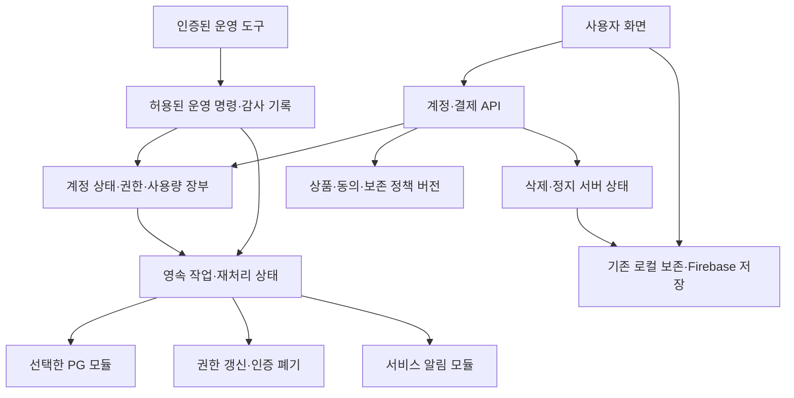

# 서비스 준비 통합 설계 — 계정·결제·보안·화면·운영

2026-10-08 · Codex · 기준 `6af3c91` · Claude 검토 결함 0(`HANDOFF-186`).
사용자 요청: 미정 가격·정책과 무관하게 필요한 서비스 구조를 빠짐없이 설계하고 기존 레일에 통합한다.
실행 상태·담당·선행 조건은 [DEV-TOKEN-ROADMAP](DEV-TOKEN-ROADMAP.md)만 관리한다.
이 문서의 SR 번호는 수용 요구사항 식별자이며 별도 실행 순서가 아니다.
[결제 기반](BILLING-FOUNDATION-DESIGN.md), [저장 계약](STORAGE-CONTRACT.md),
[U0 계약](PRODUCT-UX-U0-CONTRACT.md), [보안 설계](SECURITY-ARCHITECTURE.md)를 확장한다.
기존 승인 범위는 유지하고, 여기 추가한 설계가 구현·검증·운영까지 끝났다는 뜻으로 사용하지 않는다.

## 1. 검토 결론과 범위

F1~F5의 분리는 유효하다. 다만 기존 F3b의 요금제 표시와 F4의 PG 결제/실패 검사만으로는
계정 정지/탈퇴, 결제 실패 후 복구, 고객지원, 운영자 조정, 장부 복구가 빠진 채 F5로 갈 수 있었다.
아래 요구를 기존 F·R·L의 완료 조건에 붙이고 F3c 운영 도구와 F4 이후 R8 추가 여정을 명시한다.

| ID | 확인한 코드/문서 근거 | 추가할 계약 · 합류 지점 |
| --- | --- | --- |
| SR-01 계정·자격 | `worker/auth.js:verifyIdToken`은 JWT 서명/시간 검사, `index.html:deleteAccountEverything`은 브라우저가 순서대로 삭제 | 서버 계정 상태·최근 본인확인·폐기/정지 판정·탈퇴 작업, F2/F3a/F3b |
| SR-02 상품·가격 | `dailyLimit`은 일일 상한, `updatePlanBadge`는 토큰의 plan 표시 | 미정 설정 검증·가격/정책 버전·무료도 기간 장부·상품 약속 목록, F1/F3 |
| SR-03 결제 복구 | 결제/환불/장부는 현재 설계만 있음 | 결과 불명 조회·부분 환불·카드 변경·정산 대조·claim 역전 방지, F1/F2/F4 |
| SR-04 동의·안내 | `recordConsent`와 Rules의 `prefs/consent`는 본인이 덮어쓰는 클라이언트 기록 | 서버 동의 증적·고지/전송 기록·철회·권리 요청, F1/F2/F3/L2 |
| SR-05 보안·악용 | App Check 검증·quota·kill switch 존재, 운영 설정은 off; Firebase는 직접 SDK 쓰기 | 새 API별 소유권/역할/유량 제한·운영 권한·키 수명·삭제 fence의 Rules 연결, F3a/F3c/R7 |
| SR-06 고객 화면 | 설정/로그인/내보내기·복구 화면 존재, 지원·결제 포털 공개값은 비어 있음 | 아래 §6의 가입부터 해지/실패까지 상태 화면, F3b |
| SR-07 운영·지원 | 런북은 일일 점검과 수동 안내, 결제 작업 재처리 경로 없음 | 최소 운영 도구·권한·지원 접수·장애 공지·보상 감사, F3c/L4 |
| SR-08 데이터 수명 | B6/B7는 로컬 원문/응답, `exportAllBtn`은 문제집 JSON; 복구 런북은 Firestore 중심 | 범위별 export·삭제·보존/백업, 결제 장부 복구·재청구 방지, F2/F3/R7/R8 |
| SR-09 품질·비용 | intake 운영 503, `ai_usage`는 10% 표본, C2 실제 교재 표본 부족 | 작업별 품질/원가·표본 편향·최대 비용 방어·명시 재시도 안내, U2/C2/C3/F3/R8 |
| SR-10 공급망·호스트 | `dist/public` 빌드 존재; 시장조사는 Pages, 보안 설계는 Workers Static Assets | 호스트 일치·구 origin 자료 이동·PG SDK CSP·동일 산출물 승격, R6/R7 |
| SR-11 출시 판정 | `check-launch-readiness.mjs`는 세 파일의 값/문구만 검사 | 대상 기능별 증거 manifest·새 결제 경로 재검증·R10 뒤 활성화, R6/F4/F5/R8/R10 |
| SR-12 시장·법무 | 기존 조사 추천을 확정 정책으로 읽을 여지·현재 NOVA 월 가격 상이 | 공식 자료 기준 갱신·대상 연령/공급자 적합성·지원 약속·권리 정책 결정, D7~D13/L1~L4 |

초기 설계 대상은 기존 개인 계정·문제집 편집·출력·선택한 AI 기능이다. 팀 좌석·학생 명부·공유
문제은행·마켓·서버 조판·다국어·쿠폰/추천인·크레딧 거래는 필요한 것처럼 자동 편입하지 않는다.
그중 판매할 것을 정하면 소유권/집계/권리 계약과 별도 구현 묶음이 생긴다. 현재 UI의 `team` 라벨은
팀 기능 구현 증거가 아니다. 기존 N제 인쇄/PDF/JSON과 모의고사 HWPX의 지원 범위를 구별한다.

## 2. 미정 정책을 수용하는 공통 구조

| 설정/레코드 | 먼저 만들 구조 | 실제 값/활성화 시점 |
| --- | --- | --- |
| `PlanVersion`/`PolicyVersion` | 기능 ID·계측 단위·통화 정수 금액·세금 표기·지급/결제 기간·수치 검증·불변 버전 | D7/C3/L2/F5. 미정 `null`은 draft에서만 허용 |
| `AudiencePolicy`/`ProviderPolicy` | 허용 대상·연령 조건·AI 기능/공급자/계약 버전·지역·입출력 보존·학습 사용 조건 | D8/D12/L2, 해당 AI 활성화 전 |
| `AccountState` | UID와 분리된 내부 계정 ID, active/suspended/closing/closed, revision·revokedAfter·삭제 세대 | F2/F3a. 이메일 일치로 UID나 결제 계정을 자동 합치지 않음 |
| `PolicyAcceptance`/`ConsentRecord` | 약관 확인과 별도 동의 구별, 원문 해시/버전·서버 시각·대상 변경·철회 | F1/F3a. 기존 `prefs/consent`를 신뢰 가능한 과거 증적으로 승격하지 않음 |
| `DurableTask` | 종류·계정/대상 ID·중복 키·상태·다음 실행·시도 수·마지막 안전 오류·revision | F2. 청구/환불/claim/알림/키 폐기/삭제용; 개인정보 없는 큐 참조 |
| `RefundOperation`/`Adjustment` | 원 결제·정수 금액·사유·승인자·PG 상태·권한/사용량 영향·보상 1회 | F1/F2/F4. PG 환불과 고객 사용량 보상은 별도 작업 |
| `Notification`/`SupportCase` | 목적·템플릿 버전·전달 상태·문의 ID·담당/완료·최소 증거 참조 | F2/F3c/L4. 처음에는 검증된 외부 메일/비공개 티켓 도구 연계 가능 |
| `RetentionPolicy`/`ReleaseManifest` | 데이터 종류별 파기/보존 이유·실행 증거, release별 기능·환경·검토 증거 참조 | D13/L2/F5. 수치 미정이어도 분기와 fixture 검증은 가능 |

가격 변경은 새 버전을 발행하고 기존 계약의 적용 시점을 정하는 작업이다. 정책 미정은 설정 화면에서
'설정 필요'로 보이며, 실사용 엔진은 무료/무제한/자동 갱신 같은 의미를 임의 기본값으로 넣지 않는다.
UI와 Worker의 기능 키를 공유하되 브라우저 표시 설정은 서버 승인 권한이 아니다.
서버 기능 목록은 `implemented / tested / enabled`를 구별하며 가격표는 실제 enabled 범위만 광고한다.

### 2-1. API와 작업 인터페이스(경로는 구현 때 확정)

기존 결제 설계 §6를 확장한다. 모든 사용자 객체는 인증 owner로 선택하며 브라우저가 내부 계정 ID를
정의하지 않는다. 오류는 안전한 code·재시도 가능 여부·지원용 작업 ID만 반환한다. 변경 요청은
owner/operation별 중복 키·본문 해시·예상 revision을 검사하고 조회는 페이지 크기/기간을 제한한다.

| 인터페이스 | 책임/완료 상태 | 연결 |
| --- | --- | --- |
| 계정 상태 조회·초기화 | 기존 UID의 서버 계정을 1회 생성/연결. 동시 초기화·탈퇴 중 생성 차단, 없는 장부를 무제한 무료로 처리하지 않음 | F2/F3a |
| 정책 확인/동의·철회 | 서버가 현재 문서/변경 버전을 고정, 목적별 증적·철회 시각. 임의 과거 동의 작성 거절 | F1/F3a/F3b |
| 탈퇴 요청·진행 조회 | 최근 재인증 뒤 DeletionJob 시작, 서버/PG/현재 기기 ACK를 구별, 중복 요청 합류 | F2/F3a/F3b |
| 자료 export 요청·조회 | 대상·파일/이미지 포함 여부·만료를 명시, 생성/실패/준비·인증 다운로드, 만료/탈퇴 시 접근 폐기 | F3a/F3b |
| 결제수단 연결/교체 | owner/주문에 묶인 일회성 PG 흐름, 새 수단 확정 뒤 기존 수단 정리 | F3a/F4 |
| 내역·영수증·환불 상태 | 서버 확인한 본인 결제의 최소 정보·안전한 링크·요청 진행. 브라우저 금액으로 환불 승인하지 않음 | F3a/F3b/F4 |
| 알림 목록·확인 | 서버 고지 버전·처리 상태, 읽음은 동의와 별개 | F3a/F3b/F3c |
| 문의 접수·진행/외부 채널 | 제한된 입력·본인 접수 번호·처리 상태. 외부 도구 이용 시 같은 접근/보존 계약 | F3b/F3c/L4 |
| 운영 조회·명령 | 별도 역할/최근 운영 인증, 대상·예상 revision·사유·영향 확인·감사, 재처리는 같은 도메인 엔진 호출 | F3c |

서버 계정 상태·권한의 도입에는 기존 사용자 초기화와 중단/복귀 전략이 필요하다. schema version을
기록하고 구/신 클라이언트 호환 구간·전환 완료 검사를 둔다. 롤백으로 결제/삭제 장부나 세대를
과거로 되돌리지 않으며, 구 코드가 새 상태를 해석할 수 없다면 해당 쓰기를 차단하고 지원 경로를 제공한다.

## 3. 계정 수명·인증·접근 통제

- 일반 API는 Firebase token·App Check·현재 owner/계정 상태를 검증한다. 주문·영수증·문의·export의
  객체 ID를 바꿔 타인 자료에 접근하지 못하도록 매번 소유권을 검사한다. 응답에 billKey/내부 원문은 없다.
- 결제수단 연결/변경·탈퇴·중요 동의 변경은 서버에서 최근 `auth_time`과 폐기 상태를 검사한다.
  허용 시간은 보안 정책값이며 `iat`나 클라이언트의 '재인증 성공' 플래그로 대신하지 않는다.
  `verifyIdToken`의 현재 서명 검증을 사용자 정지/폐기 조회 완료로 간주하지 않는다.
  [Firebase 세션 관리](https://firebase.google.com/docs/auth/admin/manage-sessions).
- 무료 사용자를 포함해 계정 정지/삭제 fence는 AI·결제·업로드 경로에 적용한다. Auth 폐기만으로
  기존 JWT·다른 탭이 즉시 모두 막힌다고 가정하지 않는다. Firebase 직접 쓰기는 Rules에서 서버 소유
  계정 상태를 검사하는 확장이 필요하다. 클라이언트는 그 상태를 쓰거나 지우지 못한다.
  도입은 B3처럼 호환 규칙→클라이언트→엄격 규칙 순서로 설계·에뮬레이터 검증 후 적용한다.
- 탈퇴는 서버 `DeletionJob`에 단계별 진행을 남긴다. 새 청구/쓰기 차단 후 PG 중지/키 폐기,
  서버 개인자료 삭제, 현재 기기 B6/B7 삭제를 각자 재개할 수 있게 한다. PG 장애가 개인자료 파기를
  무기한 막는 직렬 설계는 피하고, 법정 보존 자료/미결 결제만 최소한으로 분리한다.
- U0의 현재 기기 정리·B5 파기 확인 후 Auth 삭제 순서를 보존한다. 탭이 닫히면 서버 작업은 재개할 수
  있지만 브라우저 IDB를 원격 삭제할 수는 없다. 현재 기기 확인이 누락되면 그 단계를 완료로 표시하지
  않고 재진입 시 정리한다. 다른 기기 로컬 사본까지 파기됐다고 약속하지 않는다.
  이 순서를 변경하려면 U0 삭제 계약의 별도 변경 검토가 필요하다.
- 재가입은 새 UID/새 계정이다. 삭제된 원문·권한·구독을 이메일로 찾아 자동 복구하지 않는다.
  악용 방지 기록을 무기한 개인 추적에 이용하지 않고 D13/L2의 목적·기간을 따른다.
- 운영 API는 일반 사용자 API와 역할/권한을 분리한다. 운영자 MFA·최소 IAM, 조회/환불/정지/복구
  권한 분리, 사유·전후 revision·처리자 감사 기록을 강제한다. 초기 비공개 CLI도 같은 서버 검사를 거친다.
  UI에서 버튼을 숨기거나 관리용 URL을 비밀로 하는 방식은 권한 검사가 아니다.

## 4. 결제·작업 처리·복구의 구체 경계

1. **주문**: 서버가 상품·가격·통화·세금 표시·계약 버전·owner를 고정한다. 같은 owner/작업 중복 키에
   다른 본문은 충돌이다. 취소/redirect도 상태를 다시 조회하며 URL 성공값으로 권한을 주지 않는다.
2. **결제수단**: PG hosted UI/SDK를 우선 사용한다. 서버가 발급 과정과 인증 owner를 묶고 콜백을
   한 번만 소비한다. 카드번호/CVC는 저장하지 않는다. 새 수단 연결 성공 뒤 교체하고, 구 키 폐기와
   이미 시작된 청구의 사용 수단을 기록한다. 실패하면 기존 수단이 소리 없이 없어지지 않는다.
3. **수신**: PG 공식 검증/조회 후 영속 inbox에 저장하고 응답한다. 인증되지 않은 payload에 따라
   원장을 바꾸지 않는다. PG별 event ID가 없으면 어댑터가 결제 ID·상태 버전 등으로 정규화한 키를
   정의하고 테스트한다. 크기·빈도·보존 상한으로 가짜 이벤트가 장부를 무한히 키우지 못하게 한다.
4. **재처리**: 알람 재시도만 믿지 않는다. 작업 상태·다음 실행 시각·최대 횟수와 운영 확인 대기를
   영속화한다. 장기 중단 감지 작업자가 미완료 계정/작업 색인을 훑고 원 장부와 대조한다.
   색인 쓰기 일부 실패도 복구해야 한다. 계정당 하나인 알람은 가장 이른 작업 시각으로 맞춘다.
   [DO alarm](https://developers.cloudflare.com/durable-objects/api/alarms/)은 중복 실행 가능·재시도 상한이 있다.
5. **PG 보존 창**: 멱등 키 보존이 끝나도 내부 cycle/주문 성공 기록을 잊지 않는다. 응답 불명은
   조회/수동 대조로 끝내고 새 키로 재청구하지 않는다. 토스의 현재 멱등 키 유효 기간은 15일이다.
   [공식 헤더 계약](https://docs.tosspayments.com/reference/using-api/authorization).
6. **claim 반영**: 계정별 한 쓰기 주체가 최신 revision만 반영하고 이전 재시도가 새 권한을 덮지
   않도록 직렬화·완료 대조한다. 다른 custom claim을 보존한다. 장부 권한이 최종 판정이며,
   claim 장애 때문에 이중 청구하거나 무료/유료 권한을 임의로 확대하지 않는다.
7. **환불/보상**: 누적 환불이 실결제 잔액을 넘지 않도록 원자 예약한다. 처리 중/일부 환불/실패/완료를
   구분하고 PG 결과 확인 뒤 권한을 정책대로 조정한다. 공급자 비용이 발생했다는 사실만으로
   서비스 장애에 대한 고객 환불 권리를 자동 배제하지 않는다. 비용 안전 카운터와 고객 보상 장부는 분리한다.
8. **대조**: webhook 누락·운영 콘솔 수동 취소·알람 중단·정산 금액 차이를 주기적으로 조회해
   장부와 비교한다. 운영자가 원장을 직접 덮어쓰지 않고 같은 검증/조정 명령으로 고친다.
9. **중단**: AI 중단, 새 주문 중단, 자동 갱신 중단, 클라우드 쓰기 중단을 따로 둔다.
   청구 중단 중에도 검증된 PG 수신·기존 결제 조회·해지/환불/삭제의 필요한 처리는 살아 있어야 한다.
   전체 API를 닫아 결제를 중단했다고 표시하지 않는다. 각 중단의 전파·진행 중 영향은 측정한다.

## 5. 보안·개인정보·AI 품질

API별로 무인증/잘못된 App Check/다른 owner/정지 계정/오래된 재인증/일반 사용자의 운영 호출을
거절하는 표를 만든다. body 크기·페이지 수·압축 해제 크기·동시 실행·요청률을 각각 제한한다.
계정 한도와 전체 예산을 함께 적용하고 학교/학원 NAT의 정상 요청이 IP 제한에 막히는지도 확인한다.
CORS/Origin/WAF만으로 API 또는 Firebase 직접 쓰기를 보호했다고 판정하지 않는다.
[OWASP API Top 10](https://devguide.owasp.org/en/07-training-education/07-api-top-ten/)의 객체·역할·자원 경계를 적용한다.

고객 입력·AI 응답·PG payload·지원 첨부는 신뢰하지 않는다. 기존 정규화/렌더 허용 목록과 크기 방어를
재사용하고 HTML/명령으로 실행하지 않는다. AI가 만든 URL로 서버 fetch/권한 변경을 하지 않는다.
PG redirect·영수증 링크는 허용된 HTTPS 출처/경로만 사용한다. 쿠키 기반 API를 추가할 경우
SameSite/CSRF 보호를 명시하며 기존 Bearer 인증이 자동으로 대신한다고 보지 않는다.
토큰/빌링키/카드/문제 원문이 로그·추적 URL·지원 자동 첨부·공개 번들에 들어가지 않는지 검사한다.

일반 약관 확인, AI 전송 안내, 국외이전의 적법 근거, 유료 전환 동의, 마케팅 동의는 목적이 다르다.
모두 같은 체크 한 개로 묶지 않는다. 목적별 필요 여부를 L2에서 정하고 서버 증적/철회 동작을 연결한다.
동의 철회가 클라우드 문서를 즉시 전부 지운다는 뜻이 되지 않도록 기능 중지·삭제 요청을 구분한다.
[개인정보위 2026 작성지침 안내](https://pipc.go.kr/np/cop/bbs/selectBoardArticle.do?bbsId=BS074&mCode=&nttId=12021)는
단말 내 처리와 서버 전송, 입력/생성 결과, 학습 활용과 권리행사 안내를 구체화한다.

Gemini Developer API 현행 약관은 18세 미만 대상/접근 가능성이 있는 API client 관련 제한과
유료/무료 API의 데이터 이용 차이를 둔다. 따라서 기존 14세 기준을 그대로 쓰고 공급자만 바꿀 수 없다.
D12에서 실제 서비스 대상·가입/AI 접근 경로를 정하고 D8/L2에서 계약 적합성을 확인한다.
문구 하나나 생년 체크만으로 적합성이 증명됐다고 쓰지 않는다. 다른 API 상품의 계약을 혼용하지 않는다.
[Gemini API 약관](https://ai.google.dev/gemini-api/terms).

C2 표본은 권리가 있는 합성/허가 자료로 구성하고 인쇄 PDF/실제 촬영/기울어짐/수식/그림/표/긴 지문을
나눈다. 분야별 구조 추출 오류·잘림·수정 시간·실패 비용을 기록한다. 표본 수가 적으면 정확도/p95를
일반화하지 않는다. 사용자 자료를 조용히 수집해 학습/벤치마크로 전용하지 않는다.
모델/프롬프트/계약 버전 변경은 작은 고정 평가 세트와 실패/복귀 검증을 통과해야 한다.
일괄 호출의 예상 최대 차감·순차 처리·부분 성공·재시도 차감을 실행 전에 안내하고 B5/B7 복구는 재차감하지 않는다.

## 6. 화면과 상태 계약 — F3b, 제품 작업은 기존 U1/U2

기존 라이브러리/편집 흐름을 유지하고 설정에 **계정 / 요금제·사용량 / 결제 내역 / 자료·개인정보 / 도움말**을 연결한다.
서비스 알림은 관련 화면과 설정의 알림 목록에서 확인한다. 전체 디자인 시스템 교체나 새 대시보드 프레임워크는 필요 없다.

| 화면/동작 | 보여줄 정보·행동 | 오류/취소/접근성 수용 기준 |
| --- | --- | --- |
| 첫 사용·로그인 | 로컬/계정 저장 차이·지원 출력 형식·샘플 작업·필수 정책 확인·AI 대상 조건 | 취소해도 로컬 편집 유지, 계정 전환 때 이전 결제/원문 화면 제거, 실계정 복귀 REV-075 검증 |
| AI 실행 전 | 선택 쪽·예상 차감 상한·남은 양·원문 보존과 외부 전송·검토 필요 | 실행/취소 명확, 한도 부족은 원인과 다음 선택 제공; 실패를 유료 가입 권유로 오인시키지 않음 |
| 요금제 | 서버 상품 버전·최종 결제액·세금·주기·한도 단위·갱신일·포함/미포함 기능 | 미정 상품 구매 불가, 할인/연간 환산과 실제 청구액 구별, 좌석/원문 동기화 허위 약속 없음 |
| 결제 확인 | 주문·금액·주기·갱신/취소 조건·별도 동의·PG 이동 | 금액/상품 바뀌면 다시 확인, 뒤로가기/중복 클릭/리다이렉트 실패에도 동일 주문 조회 |
| 사용량 | 사용/예약/잔여·기간 시작/끝·초기화 기준·서비스 일시 중단 여부 | 오래된 조회는 확인 시각 표시, 여러 탭 경쟁 시 서버 판정, 무료량도 같은 기준 |
| 결제수단·내역 | 마스킹 수단·교체·결제/환불 상태·영수증·문의 ID | 수단 교체 실패는 기존 수단 보존, 타인 영수증 비노출, 세금계산서/현금영수증 지원 범위는 D9/L2 |
| 해지·재동의 | 현재 이용 종료일·다음 청구 중단·변경 전후 금액/일시·동의 철회 | 해지 입구가 가입보다 숨겨지지 않음, 불필요한 설문 강제 없음, 처리 중/완료/지원 필요 구별 |
| 환불·장애 보상 | 접수 가능 경로·정책·금액/진행 상황·이의 제기 | 접수와 승인/입금 완료 구별, AI 사용 사실만으로 자동 거절하지 않음 |
| 자료·개인정보 | 원문/문제집/결제 기록별 위치·export 범위·삭제 영향·진행 단계 | 삭제 전 대상/복구 가능성 확인, 부분 실패 후 재개, 다른 기기 파기 보장 금지 |
| 도움말·상태 | 지원 기기/출력·사용 예·장애 공지·권리/개인정보 신고·문의 | 앱 로그인 장애 중에도 지원 접근, 문의에 원문 자동 첨부 금지, 응답 시간은 D13 확정값만 |

모든 새 화면은 키보드 순서·포커스 복귀·화면낭독기 이름/상태 알림·색상 외 상태 표현·확대/좁은 화면을 검증한다.
결제/삭제에는 내용을 검토·수정하거나 취소하는 단계가 있다. WCAG 2.2 AA를 검증 목표로 삼되 자동 검사만으로
인증을 주장하지 않는다. [금전/데이터 오류 예방](https://www.w3.org/WAI/WCAG22/Understanding/error-prevention-legal-financial-data.html),
[최소 타깃 크기](https://www.w3.org/WAI/WCAG22/Understanding/target-size-minimum.html).
기존 1194×834·768×1024·375×812 과제를 재사용하고 모바일 PG 복귀·뒤로가기·실제 iOS는 F4 이후 추가 확인한다.

## 7. 알림·지원·운영 도구

결제 성공/실패·갱신/금액 변경 동의·해지·환불·계정 삭제·장애 공지를 서비스 알림으로 정의한다.
결제/권한 트랜잭션과 함께 notification outbox를 기록하고 외부 전송은 별도 모듈이 수행한다.
전송 중복 키·시도 수·반송·지원 필요 상태를 보존한다. '메일 전송됨'은 '고객이 읽거나 동의함'이 아니다.
전달 실패를 이유로 동의를 추정하지 않는다. 마케팅 전송은 현 범위에 넣지 않는다.
L4에서 수탁자 계약·발신 도메인 SPF/DKIM/DMARC·수신/반송 실험을 마친 채널만 활성화한다.

초기 운영 도구는 비공개 CLI/보호된 최소 화면으로 충분하다. 기능은 계정/주문 상태 조회, 미완료 작업,
PG 대조 차이, 허용된 환불/보상·정지/복원 요청, 키 폐기/삭제 재처리, 지원 접수/완료 기록이다.
원문 열람·사용자 사칭·DB 임의 편집·토큰 조회를 기본 기능으로 만들지 않는다.
환불/권한 변경은 사유·대상·금액·예상 영향을 미리 보여주고 서버에서 권한을 다시 검사한다.
복구/대규모 조정의 독립 승인자는 실제 지정해야 하며 AI 자기검토로 사람 운영 승인을 대신하지 않는다.

지원은 이메일과 비공개 티켓 기록을 연결하는 수준부터 가능하다. 개인정보/저작권 신고, 결제 분쟁,
자료 유실을 구분하고 접수 번호·처리자·상태·보존 정책을 둔다. 추가 자료는 본인 확인과 필요 범위를
설명한 뒤 받는다. D13의 처리 시간/운영 시간·장애 연락 담당·대체 담당을 정해 런북에 넣는다.
지원 도구 접근 장애 시 연락 경로와 계정 복구 절차도 확인한다.

운영 지표는 API 오류/지연, 저장 실패, AI task별 실패/잘림, 장부 미완료/알람 지연/PG 차이,
알림 반송, 탈퇴 지연, 비용원별 사용량이다. 일반 제품 telemetry에는 원문·파일명·UID·토큰을 넣지 않는다.
비공개 결제/지원 장부의 필요한 계정 연결은 목적·접근 권한·보존 기간을 별도로 정한다.
10% `ai_usage` 로그를 총 과금 원장으로 쓰지 않는다. 알림은 실제 수신자를 호출하는 시험까지 완료해야 한다.

## 8. 데이터 수명·이전·복구

| 자료 | export/이전 계약 | 삭제·복구 계약 |
| --- | --- | --- |
| 문제집·모의고사·이미지 | 기존 JSON/HWPX 범위를 표시; 이미지가 URL 참조인지 실제 포함인지 검증 | 격리 복원 후 개수·참조·revision·인쇄 확인; 오래된 덤프를 운영에 바로 덮지 않음 |
| 로컬 원문·B6/B7 결과 | JSON 전체 내보내기가 이 자료의 백업은 아님. 새 origin에서는 원문 명시 재연결; 미채택 작업은 기존 origin에서 처리/보관 안내 | 삭제 세대/owner 계약 유지, 원문 클라우드 동기화나 SW 종료 중 처리 보장 추가 없음 |
| 계정/동의/지원 | 본인 권리 요청 범위·최소 증거, 서버 export는 만료/인증된 다운로드 | 데이터 종류별 보존 이유·파기 작업·실패 기록; 탈퇴 후 필요한 증빙만 분리 |
| 결제/사용량/작업 장부 | 사용자용 명세와 운영 복구본을 구분 | 결제·환불·키·삭제 세대·작업 색인을 함께 대조; 과거 백업으로 이미 끝난 청구를 재실행하지 않음 |

R7 이전은 새 도메인/CSP/Auth/App Check·공개 빌드 확인 → 구 origin export와 새 origin import 실험 →
안내 기간 → 전환 순서다. 원문/미채택 결과가 자동 이동하지 않는다는 안내와 지원 경로를 포함한다.
SW는 outbox 전용 범위를 유지하고 HTML 캐싱을 새로 켜지 않는다. 새 런타임 파일은 `serve.py STATIC`과
`build-public.mjs PUBLIC_INPUTS`에 함께 등록하고 source CSP·공개 빌드 CSP를 대조한다.

백업은 Firestore뿐 아니라 Storage 객체·결제 DO·서버 색인·삭제 fence·설정/키 복구 가능성까지 범위를 정한다.
RPO/RTO와 보존 기간은 D13 값이다. 복원 중 청구를 멈추고 삭제 기록을 우선 적용한 다음 PG 현재 상태와
대조하며, 운영자가 확인한 뒤에만 스케줄을 재개한다. 복구 작업의 독립 승인/비공개 증거는 기존 런북을 따른다.
DO PITR은 SQLite 객체 단위이며 로컬 개발에서 지원되지 않는다. F2 로컬 테스트는 운영 PITR 실험을 대체하지
않는다. [Cloudflare 저장 API](https://developers.cloudflare.com/durable-objects/api/sqlite-storage-api/).
백업의 삭제 자료가 다시 살아나는 경로·키 폐기 뒤 복호화 불가·부분 복원도 리허설 대상이다.
삭제/환불/청구의 최신 확인 기록을 복원 대상 장부와 함께 과거로 되돌리면 이 대조는 불가능하다.
최소 삭제 저널·복구 체크포인트는 별도 보호/보존 경계를 두고, PG 사실과 함께 복원 기준 시점 이후의
변경을 재적용한다. 최신 삭제 증거를 확보하지 못한 계정은 자료 공개·청구 재개를 보류한다.
저널의 식별 범위·보존 기간·접근 권한도 D13/L2에서 정하며 무기한 개인정보 보관을 기본으로 두지 않는다.

## 9. 출시·검증 계약

`check:launch`의 현재 설정 검사와 운영 준비 판정을 구별한다. F5에서 `ReleaseManifest` 검사를 확장한다:
release commit/산출물 hash, 환경, 기능 목록, plan/policy/legal/provider 버전, 검토 기록,
Rules/Worker/binding 버전, 브라우저/PG/복구 증거 위치·확인 시각·담당자·미확인 이유를 묶는다.
빈 문자열을 채우거나 새 플래그 하나를 켜서 통과할 수 없도록 누락/다른 환경/이전 revision 증거를 거절한다.
콘솔 상태를 코드가 확인하지 못하면 서명/접근 통제된 수동 증거로 남기고 자동 확인했다고 쓰지 않는다.

| 출시 대상 | 필요한 범위 |
| --- | --- |
| 격리 fixture | 합성 자료·가짜 PG/AI·테스트 정책, 운영 endpoint 비연결 |
| 공개 무료 서비스 | R5/R6/R7/R8의 개인정보·보안·저장·지원·비용 게이트, 제공 AI의 실제 계약/품질 검증. PG 결제 비활성 |
| 유료 P1 초대 베타 | 무료 서비스 조건 + 결제 정확성·재동의·약관/처리방침/환불·연령·탈퇴·권한 검사 전부, 서버 초대 허용 목록. 편의 기능은 결제사 화면·CLI·이메일로 대체. R10 베타 판정, 별도 활성화 승인 |
| 유료 P2 공개 판매 | P1 + 이 설계의 나머지 요구 전부(§6 전체 화면·§7 운영 도구/알림·§8 RPO/RTO 리허설·§9 ReleaseManifest 전체). R10 공개 판정, 별도 승인 |

무료라는 이유로 상용 SaaS 호스팅 제한·개인정보 조건을 면제하지 않는다. F5는 **활성화 준비**이며
R10보다 먼저 결제/자동 갱신을 켜는 단계가 아니다. R10 판정 후 승인된 범위로 활성화하고 관찰한다.
R5/R6가 먼저 끝났어도 그 뒤 추가한 결제 코드는 묶음별 독립 검토·영향 검사 대상이다.
R8은 제품 기본 여정에 더해 **F4 이후 결제 추가 여정**을 수행한다. 전체 과거 검사를 무조건 다시
하는 대신 새 기능과 영향을 받은 경로의 같은 release 증거를 확보한다.

| 실패 주입/시나리오 | 합격 조건 | 담당 묶음 |
| --- | --- | --- |
| 다른 owner 주문·영수증·지원 조회 / 일반 사용자의 운영 명령 | 비노출·쓰기 거절, 안전 오류 | F3a/F3c |
| 정지/폐기 토큰·오래된 본인확인·다른 탭 삭제 경합 | 새 청구/AI/직접 Firebase 쓰기 차단, 현재 기기 정리 상태 정확 | F3a + Rules/R8 |
| 기존 계정 동시 초기화·구/신 schema·부분 롤백 | 계정/지급 중복 없음, 삭제 세대 유지, 해석 불가 쓰기 거절 | F2/F3a/R7 |
| 가격/동의/수단 변경 직후 뒤로가기·중복 클릭 | 고정 주문·명시 재확인, 잘못된 owner에 연결 없음 | F1/F3b/F4 |
| PG timeout·중복/역순·멱등 창 만료·콘솔 수동 환불 | 새 청구 없이 대조, 환불 잔액/권한 정합 | F2/F4 |
| 알람 재시도 소진·색인 기록 중단·claim 역전·전송 반송 | 영속 상태에서 발견/재개, 옛 권한/동의 부활 없음 | F2/F3c/F4 |
| 서버 탈퇴 중 탭 종료·PG 장애·local purge 실패 | 단계별 재개, 미완료를 완료로 표시하지 않음 | F2/F3a/F3b |
| 무료 기간 마지막 단위 경합·오래된 UI·B7 복구 | 한도 우회/중복 차감 없음 | F2/F3/R8 |
| 원문 export 누락·origin 이전·삭제 뒤 백업 복원 | 범위 안내·명시 재연결·삭제 자료 부활/재청구 없음 | R7/R8/F4 |
| 안내/설정 키보드·확대·실제 iOS PG 복귀 | 완료/취소/재시도 가능, 포커스·낭독 상태 정확 | F3b/F4/R8 |
| 활성화 설정 누락·staging 증거 대입·billing stop | 출시 검사 실패, 중단 중 해지/조회 가능 | F5/R10 |

구현 회귀는 각 방어를 제거한 red mode 또는 기준 커밋 실패를 확인해 `check:fast`에 연결한다.
테스트마다 fixture/local browser/staging/live 관찰을 표시한다. PG live 결제·실제 AI·외부 메일·배포는
시험을 작성했다는 이유로 자동 실행하지 않는다. 기존 운영 intake 503은 승인된 활성화 전까지 유지한다.

## 10. 조사 근거와 적용 판단

확인일 2026-10-08. 아래는 공개 안내를 읽은 결과이며 실제 가입/결제·계약 견적·사용성 실측은 하지 않았다.
가격·성능 주장은 판매자 설명이며 우리 가격·정확도나 구매 의사를 증명하지 않는다.

| 공식 출처 | 확인한 내용 | 이 설계의 판단 |
| --- | --- | --- |
| [NOVA 월간](https://www.novahwp.com/pricing/monthly) | Go 14,900·Plus 39,900·Ultra 정가 119,000원/월, 토큰과 문항 추정치 구별 | 기존 조사와 청구 주기/가격 근거 차이를 명시. 가격표에는 청구 주기·실제 결제액·추정량 구별 |
| [마이일타 비용](https://www.my1ta.com/guide/pricing) | 작업별 크레딧·보너스 수명·예상 상한 선차감/차액 처리 안내 | 차감 이유/예약/실패 처리의 설명 필요. 경쟁사 방식으로 우리 차감 계약을 바꾸지는 않음 |
| [매쓰플랫 요금](https://www.mathflat.com/pricing/) | 콘텐츠/학생 관리가 포함된 상품, 체험 후 직접 가입 선택 | 서로 다른 상품을 문항당 가격 하나로 비교하지 않음. 체험 자동 결제 여부를 명확히 표시 |
| [매쓰플랫 FAQ](https://www.mathflat.com/news/faq/?category=8) | 결제수단 변경·세금계산서·지원 채널 안내 | 결제 버튼 외에도 고객 관리/증빙 경로가 필요 |
| [Gemini 공식 가격](https://ai.google.dev/gemini-api/docs/pricing) | 3.1 Flash-Lite standard text/image 입력 $0.25·출력(생각 포함) $1.50/백만 토큰 | 단가는 공식 자료로 갱신, 대표 원가/수익은 C2/C3 검증 전 추정 |
| [GitHub Pages 제한](https://docs.github.com/en/pages/getting-started-with-github-pages/github-pages-limits) | 온라인 사업/상업 SaaS를 위한 무료 호스팅 사용 제한 | 무료 서비스면 허용된다는 결론 삭제. 이전은 기존 R7 Workers Static Assets 기준 |
| [Workers Static Assets](https://developers.cloudflare.com/workers/static-assets/) | Worker 기반 정적 자산 제공 | Pages와 별도 제품임을 구별하고 기존 보안/배포 설계 재사용 |
| [토스 webhook](https://docs.tosspayments.com/guides/v2/webhook) | 응답 기한과 유한 재전송 | 빠른 영속 수신·별도 처리·누락 대조 필요 |

핵심 서비스가 실제로 유용한지는 R8에서 선생님의 허가 자료로 첫 작업 완료·수정량·다시 출력하는 횟수와
지원 요청을 관찰해 판단한다. 경쟁사 표가 이 관찰을 대신하지 않는다. 가격 선호·지불 의사 인터뷰는
D7 판단 자료로 준비하되 이번 조사에서 고객에게 연락하거나 데이터를 수집하지 않았다.

## 11. 재사용과 구현 경계

기존 Auth/App Check verifier·quota·AttemptLedger·B6/B7·정규화/렌더·공개 빌드·브라우저 테스트 하네스를 재사용한다.
공급자 공식 SDK/호스팅 결제 UI·Firebase 관리 API·DO 영속 저장·기존 이메일/티켓 서비스를 후보로 둔다.
SDK 채택 시 Workers 호환·라이선스·고정 버전·CSP·개인정보·테스트/live 분리를 R6/F4에서 확인한다.
결제에 맞추려는 전체 프레임워크 교체나 자체 카드 보관/자체 메일 서버는 필수가 아니다.

이번 산출물은 계약·의존성·수용 검사의 설계다. 운영 콘솔/키/백업/실기기·법무 적합성은 미검증이며
해당 기능 출시 전에 증거를 요구한다. '설계에 있음'·'구현됨'·'검증됨'·'활성화됨'을 각각 기록한다.
